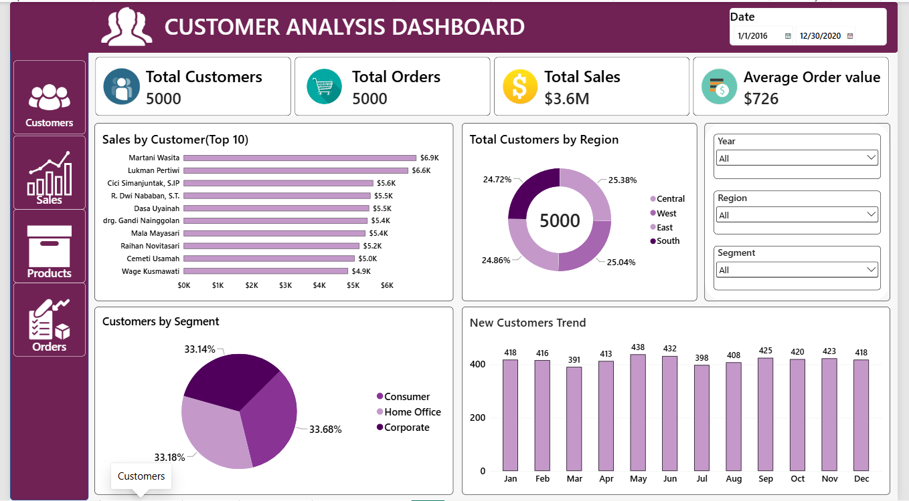
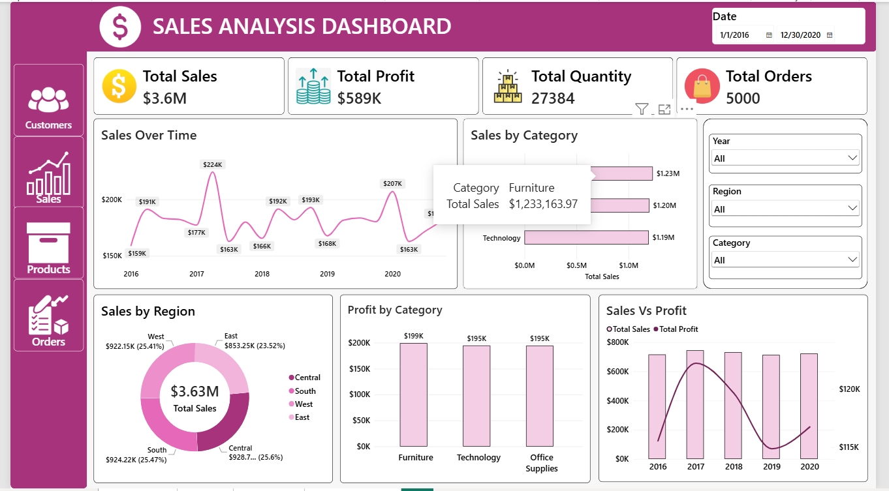
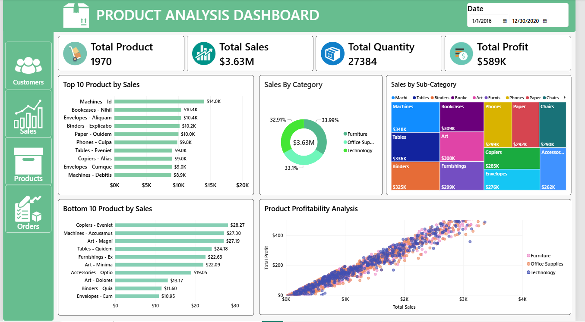
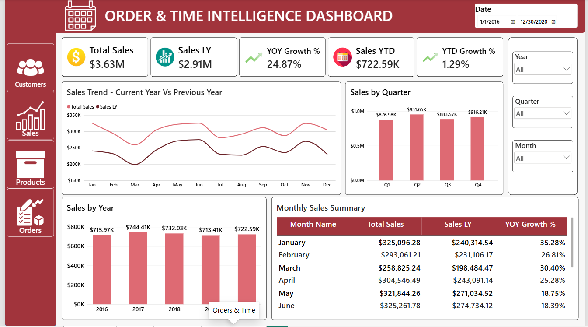

# 📊 Power BI Retail Sales Analysis Dashboard

## 📌 Project Overview

This project is an interactive **Power BI Retail Sales Analysis Dashboard** developed to analyze sales performance, customer behavior, product performance, and order trends.

The dashboard uses **Power Query, DAX, Data Modeling, and interactive visualizations** to transform retail data into meaningful business insights.

---

## 🎯 Project Objectives

- Analyze overall sales and profit performance
- Understand customer purchasing behavior
- Identify top and bottom-performing products
- Analyze sales by category, sub-category, and region
- Track sales trends over time
- Perform time intelligence analysis
- Build an interactive business intelligence dashboard

---

## 🛠️ Tools & Technologies

- Power BI Desktop
- Power Query
- DAX
- Data Modeling
- SQL
- Microsoft Excel

---

# 📊 Dashboard Preview

## 1️⃣ Customer Analysis

The Customer Analysis page provides insights into customer performance and purchasing behavior.

**Key Analysis:**
- Total Customers
- Total Orders
- Total Sales
- Average Order Value
- Customer Segments
- Top Customers
- Regional Customer Analysis

### Dashboard Screenshot

---

## 2️⃣ Sales Analysis

The Sales Analysis page provides an overview of overall business performance.

**Key Analysis:**
- Total Sales
- Total Profit
- Total Quantity
- Total Orders
- Sales by Category
- Sales by Region
- Profit Analysis
- Sales Trends

### Dashboard Screenshot

---

## 3️⃣ Product Analysis

The Product Analysis page focuses on product and category performance.

**Key Analysis:**
- Top 10 Products
- Bottom 10 Products
- Sales by Category
- Sales by Sub-Category
- Product Quantity
- Product Profitability

### Dashboard Screenshot

---

## 4️⃣ Order & Time Intelligence

This page focuses on order trends and time-based analysis.

**Key Analysis:**
- Total Sales
- Sales YTD
- Sales LY
- YOY Growth %
- YTD Growth %
- Sales by Year
- Sales by Quarter
- Monthly Sales Trends

### Dashboard Screenshot

---

# 🔄 Data Preparation

The data was cleaned and transformed using **Power Query**.

### Data Cleaning

- Removed duplicate records
- Handled missing values
- Changed data types
- Renamed columns
- Created calculated columns
- Performed data transformations
- Prepared data for modeling

---

## Author

Deepak Chavan
